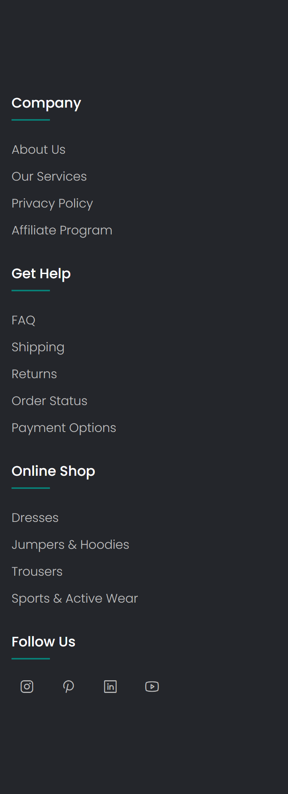

# Building a Stylish Footer Using HTML and CSS

Footers are an essential component of any website, providing important information and navigation links to users. In this tutorial, we'll explore how to create a modern and visually appealing footer using only HTML and CSS.

## HTML Structure
Let's begin by understanding the HTML structure of our footer. We'll use semantic HTML tags to organize our content effectively. **Here's a simplified version of our HTML structure:**

```html
<!DOCTYPE html>
<html lang="en">
<head>
    <meta charset="UTF-8">
    <meta name="viewport" content="width=device-width, initial-scale=1.0">
    <link rel="preconnect" href="https://fonts.googleapis.com">
    <link rel="preconnect" href="https://fonts.gstatic.com" crossorigin>
    <link href="https://fonts.googleapis.com/css2?family=Poppins:ital,wght@0,100;0,200;0,300;0,400;0,500;0,600;0,700;0,800;0,900;1,100;1,200;1,300;1,400;1,500;1,600;1,700;1,800;1,900&display=swap" rel="stylesheet">
    <link rel="stylesheet" href="./styles.css">
    <script src="https://unpkg.com/@phosphor-icons/web"></script>
    <title>Footer</title>
</head>
<body>
    <div class="footer">
        <div class="container">
            <div class="row">
                <div class="footer-col">
                    <h4>Company</h4>
                    <ul>
                        <li><a href = '#'>about us</a></li>
                        <li><a href = '#'>our services</a></li>
                        <li><a href = '#'>privacy policy</a></li>
                        <li><a href = '#'>affiliate program</a></li>
                    </ul>
                </div>
                <div class="footer-col">
                    <h4>Get Help</h4>
                    <ul>
                        <li><a href = '#'>FAQ</a></li>
                        <li><a href = '#'>shipping</a></li>
                        <li><a href = '#'>returns</a></li>
                        <li><a href = '#'>order status</a></li>
                        <li><a href = '#'>payment options</a></li>
                    </ul>
                </div>
                <div class="footer-col">
                    <h4>Online Shop</h4>
                    <ul>
                        <li><a href = '#'>dresses</a></li>
                        <li><a href = '#'>jumpers & hoodies</a></li>
                        <li><a href = '#'>trousers</a></li>
                        <li><a href = '#'>sports & active wear</a></li>
                    </ul>
                </div>
                <div class="footer-col">
                    <h4>Follow Us</h4>
                    <div class='social-icons'>
                        <a href = '#'><i class="ph ph-instagram-logo" style="font-size: 20px"></i></a>
                        <a href = '#'><i class="ph ph-pinterest-logo" style="font-size: 20px"></i></a>
                        <a href = '#'><i class="ph ph-linkedin-logo" style="font-size: 20px"></i></a>
                        <a href = '#'><i class="ph ph-youtube-logo" style="font-size: 20px"></i></a>
                    </div>
                </div>
            </div>
        </div>
    </div>
</body>
</html>
```

**CSS Styling**
Now, let's add some CSS styles to make our footer visually appealing. We'll focus on creating a clean layout, applying colors, and adding some spacing. Here's the CSS code:

```css
*,
::before,
::after{
    margin:0;
    padding: 0;
    box-sizing: border-box;
}

body{
    background: #24262b;
    font-family: "Poppins", sans-serif;
    padding:0;
    margin:0;
}

.footer{
    padding: 70px 0;
}

.container{
    max-width: 1170px;
    margin: 50px auto 0;
}

.row{
    width:100%;
    display:flex;
    flex-wrap: wrap;
}

.footer-col{
    width:25%;
    padding: 0 15px;
}

.footer-col h4{
    font-size: 18px;
    color:#fff;
    font-weight: 500;
    margin-bottom: 35px;
    position: relative;
}

.footer-col h4::before{
    content: '';
    position: absolute;
    left: 0;
    bottom: -10px;
    height: 2px;
    width:50px;
    background: #088178;
    box-sizing: border-box;
}

.footer-col ul{
    list-style: none;
}

.footer-col ul li:not(:last-child){
    margin-bottom: 10px;
}

.footer-col ul li > a{
    font-size: 16px;
    font-weight:300;
    color:#fff;
    text-transform: capitalize;
    text-decoration: none;
    color:#bbb;
    display: block;
    transition: .3s ease;
}

.footer-col ul li > a:hover{
    color:#fff;
    padding-left: 8px;
}

.footer-col .social-icons{
    font-size:16px;
}

.footer-col .social-icons > a{
    display:inline-block;
    width:40px;
    height:40px;
    text-align: center;
    margin:0 10px 10px 0;
    color:#bbb;
    transition: all .3s ease;
    text-decoration: none;
}


.footer-col .social-icons > a:hover{
    transform: translateY(-5px);
    color:#fff;
}

@media (max-width:768px){
    .footer-col{
        margin-bottom: 30px;
        width:50%;
    }
}

@media (max-width:539px){
    .footer-col{
        width:100%;
    }
}

```
With these HTML and CSS codes, you can create a stylish and functional footer for your website. Feel free to customize the styles according to your website's design requirements.

That's it! You now have a fully functional footer created using HTML and CSS. Experiment with different styles and layouts to match your website's design aesthetic.

## On Large Screen


## On Small Screen

